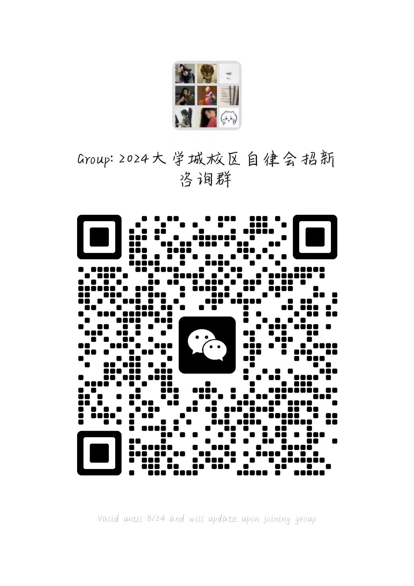

# 自律会

### 简介

广东外语外贸大学学生社区自律委员会，简称自律会，
旨在促进学生社区精神文明建设，保障学生正常地学习、
生活，全面推进思政工作进学生社区，帮助青年学生树立自尊、
自爱、自立、自信、自强的大学生形象的组织❣

### 自律会下设部门
🚀 综合管理部：负责自律会内部的财务管理、档案管理、
会务服务、组织成员培训发展、人事管理与考核、组织内外交流、
公寓文化室管理等工作，做好自律会人才队伍建设。

📝 社区文化部：负责在全校范围内策划组织各项活动，
创新活动的开展形式，打响自律会品牌特色，推动社区
文化的蓬勃发展，营造积极向上、和谐共进的社区氛围。

🌐 社区宣传部：构建多元化宣传体系，通过多形式、多渠道
自律会及其下辖部门、举办的各类活动及会议进行广泛宣传，
树立自律会的良好形象，提高自律会知名度。

🔍 社区督导部：贯彻落实学校各项对于宿舍管理措施及规定；
管理和监督楼长、层长的工作；管理好各宿舍长群，及时传达
各项通知；维持宿舍内的安全和秩序，促进良好宿舍关系、文明宿舍环境的建设。

📚 社区服务部：组织调研工作，运用问卷调查、采访等形式
深入了解学生学生需求，整理反馈学生意见，切实解决学生问题，
以维护学生各项权益；组织开展志愿活动，以促进学生间的团结互助。

### 🌈 加入我们，你将获得
✅志愿时和劳动时：在奉献中收获成长，志愿时长助你社会实践更丰富。

✅能力提升：组织策划、沟通协调、团队合作……全方位锻炼你的综合能力。

✅温暖大家庭：结识志同道合的朋友，共同度过大学的美好时光。

**欢迎大家加入自律会哇！！**
### 招新咨询群二维码

若招新二维码过期，请联系MsR