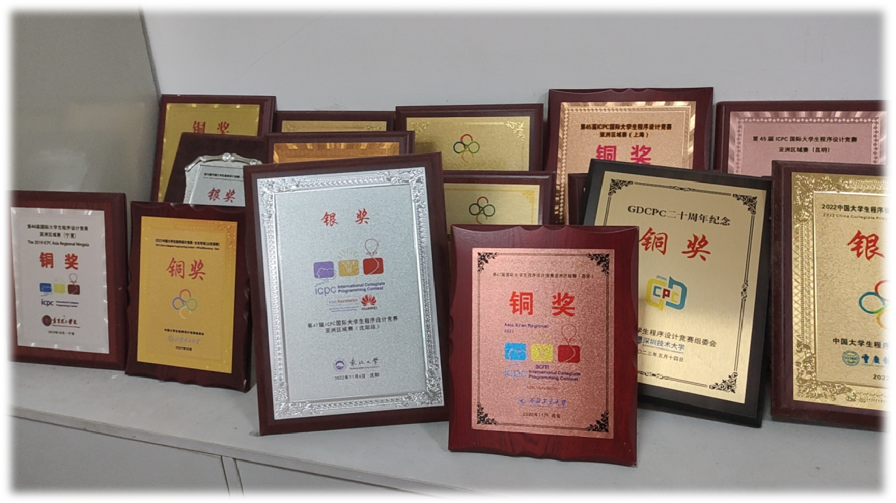

# ACM实验室

## 简介
ACM 美国计算机协会(Association for Computing Machinery) 成立于计算机诞生次年，是目前
计算机学界中历史最悠久、最具权威性的组织，是推进信息技术专业人员和学生提高技巧
的主要力量。

 ACM国际大学生程序设计竞赛（英文全称：ACM International Collegiate Programming
 Contest（ACM 或 ICPC）是由ACM主办的，一项旨在展示大学生创新能力、团队精神和在
压力下编写程序、分析和解决问题能力的年度竞赛。经过30多年的发展，ACM国际大学生
程序设计竞赛已称为世界各国大学生中最具影响力的国际级计算机类的赛事， 是广大爱好
计算机编程的大学生展示才华的舞台，是信息企业与世界顶尖计算机人才对话的最好机
会。

## ACM竞赛特点与作用
 赛题涵盖和涉及学科知识面广泛，与实际应用的联系很紧密且具有创造性。直接涉及的学科有
程序设计、数据结构，算法设计，图论，规划，人工智能，计算几何，计算机图形学，数论，
离散数学，组合数学，操作系统，编译原理，英语等。很多赛题被出题者描述成一个有趣的故事，
其本质就是最近一个计算机科学技术领域的成果，也有些赛题以操作系统或是编译原理中模型的形式给出。
这使得一次竞赛不仅有趣和充满挑战性，也具有更加深远的意义。

## 主要的竞赛
ACM国际大学生程序设计竞赛(ICPC)

ACM中国大学生程序设计竞赛(CCPC)

ACM广东省大学生程序设计竞赛(GDCPC)

ACM中国团体程序设计天梯赛(CCCC-GPLT)

各著名大学举办的网络赛、院赛和校赛

## 近几年成果

2022，2023，2024广东省大学生程序设计竞赛银，铜奖

2022，2023，2024中国大学生程序设计天梯赛一，二,三等奖

2022ICPC沈阳站银奖

2022ICPC西安站铜奖

2022CCPC桂林站铜奖

2022CCPC中国大学生女生赛银奖

***欢迎大家加入广外ACM大家庭！！！***
